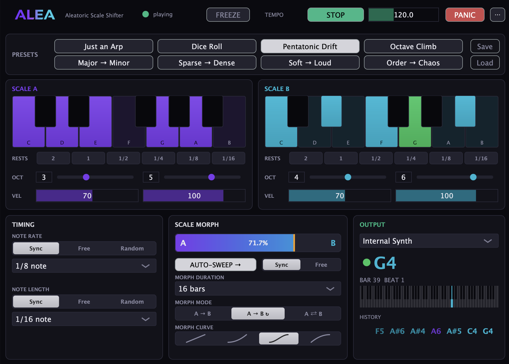

# Alea

**Aleatoric Scale Shifter** - a generative MIDI plugin. Pick a set of notes,
press play, and Alea streams random notes from that set into your DAW, slowly
morphing toward a second note set over time.

Alea was made with a particular vision in mind: exploring the relationship
between an improvising human player and a machine that randomly shifts from a
diatonic scale to complete dodecaphony over time.



## Features

- **Two scales** (A and B): pick pitch classes on a keyboard, set octave and
  velocity ranges, and add weighted rests (2 bars down to 1/16) that roll
  like notes do.
- **Scale Morph**: blend the probability of drawing from A vs. B - drag the
  bar, automate it, bind a MIDI CC (right-click the bar), or engage
  **AUTO-SWEEP** to travel on its own: One-Shot, Loop, or Bounce, over bars
  or free time, shaped by linear/exponential/S/logarithmic curves. Grab the
  bar mid-sweep to scrub; the sweep re-anchors and keeps going.
- **Timing**: note rate and length synced to the host (1/64 note to 4 bars),
  free-running in ms/seconds, or rolled randomly per note.
- **Performance controls**: Freeze (hold the stream), Panic (all notes off).
- **Monitoring**: activity LED, current note, bar/beat, an 88-key strip, and
  an event history ticker - everything colored by which scale it came from.
- **8 factory presets** - from *Just an Arp* to *Order → Chaos*, the
  three-minute journey from five quiet notes to full dodecaphony - plus
  save/load of your own patches as `.alea` files.
- Deterministic per session: loop playback re-rolls the same choices, so what
  you heard is what you'll hear again.

Full product spec: [docs/SPEC.md](docs/SPEC.md) (snapshot of the canonical
Notion spec; build deltas tracked in the Notion "Build Addendum" page).

## Status

**v0.1** - VST3 on macOS, milestones M1–M4 complete (engine, host sync, full
UI, presets & controls). Every build passes
[pluginval](https://github.com/Tracktion/pluginval) at strictness 10.

Planned: standalone app with its own transport and direct MIDI device output
(M5), AU and CLAP formats (M6).

## Building

Requires: macOS, Xcode command-line tools, CMake ≥ 3.22
(`brew install cmake`). JUCE is downloaded automatically on first configure.

```sh
cmake -B build -DCMAKE_BUILD_TYPE=Release
cmake --build build
```

The VST3 is copied to `~/Library/Audio/Plug-Ins/VST3/` after a successful
build, so it shows up in your DAW's next plugin scan. The standalone app ends
up under `build/Alea_artefacts/`.

## Using it in a DAW

Alea generates MIDI notes - it makes no sound of its own. It is classified as
a VST3 *instrument* (with silent audio) because hosts have no common slot for
third-party MIDI-effect plugins.

In Ableton Live:

1. Build (above), then rescan plugins in Live's settings if Alea doesn't
   appear (hold Alt for a full rescan - Live caches failed loads).
2. Drop **Alea** onto a MIDI track.
3. On a second MIDI track with any instrument: set **MIDI From** to the Alea
   track and pick **Alea** in the chooser below it.
4. Arm the instrument track and press Play - you'll hear notes drawn from
   Scale A. Pick a preset, or hit AUTO-SWEEP and let it travel.

## Troubleshooting

**No sound from the plugin?**

1. Alea makes no audio of its own - its MIDI must reach an instrument on
   another track.
2. On the instrument track, set **MIDI From** to the Alea track and pick
   **Alea** in the chooser below it (not "Post FX").
3. Arm the instrument track (record button) so it receives MIDI.
4. Press Play - Alea follows the host transport; the dot in Alea's header
   should read "playing".
5. Still nothing? Check the morph bar: at 100% B with an empty Scale B there
   is nothing to play. Hit PANIC once if a note seems stuck.
6. Alea missing from Live's browser? Settings > Plug-Ins, hold Alt and click
   Rescan (Live caches plugins that previously failed to load).

**Standalone app silent?** Pick **Internal Synth** in the OUT dropdown
(OUTPUT panel) and press PLAY.

## Feedback

I'll be more than happy to hear your feedback, ideas, and music made with
Alea - open an issue here or write to yuvalprod@gmail.com.

Plugin made by Yuval Egozi.
