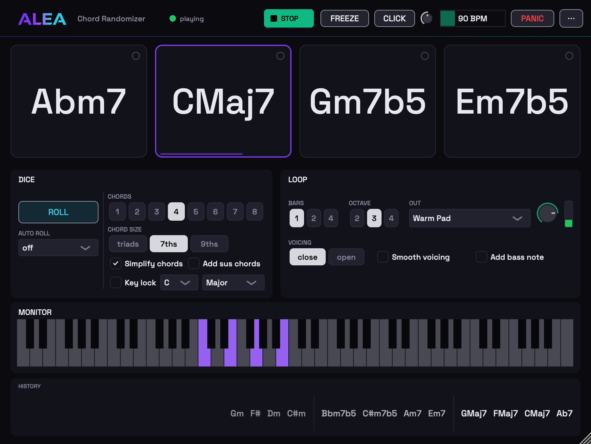
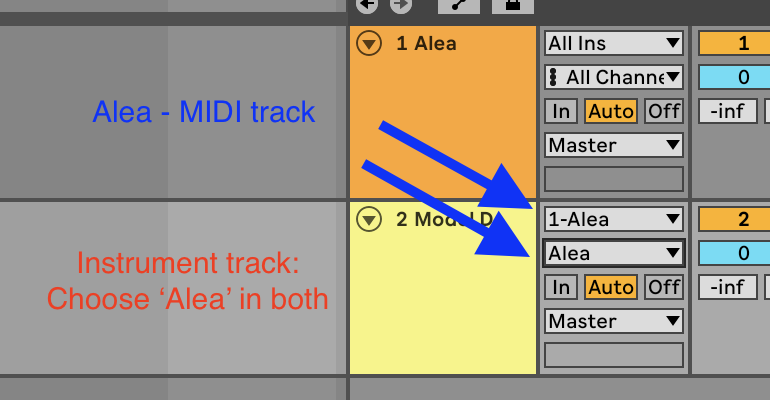

# Alea

Small instruments for improvising musicians.
Built around random elements (*alea* is Latin for dice, as in aleatoric
music).




| | What it is | Get it |
|---|---|---|
| **[Alea Scale Shifter](#alea-scale-shifter)** | Random notes from a scale, slowly morphing into another scale | [Latest release](https://github.com/yuvalEG/Alea/releases?q=%22v0.%22&expanded=false) (`Alea-x.y.z` files) |
| **[Alea Chord Randomizer](#alea-chord-randomizer)** | Random chords, looped. Improvise over them | [Latest release](https://github.com/yuvalEG/Alea/releases?q=chords&expanded=false) (`AleaChordRandomizer-x.y.z` files) |

Each product releases on its own. Download just the one you want.

---

## Alea Scale Shifter

Pick a set of notes and press play. Alea streams an endless, never-repeating
line from them, slowly drifting toward a second set, from a scale you know
all the way to full dodecaphony, while you play against the drift.

### What it does

- **Two scales**, A and B: notes, octaves, velocities, and rests that roll
  just like notes.
- **Scale Morph**: blend between them by hand, by automation, by MIDI CC,
  or let **AUTO-SWEEP** travel on its own.
- **Timing**: locked to your DAW, free-running, or rolled anew per note.
- **A warm built-in synth** in four flavours, so it makes sound anywhere
  with zero routing.
- **10 presets**, from *Just an Arp* to *Order → Chaos*, plus your own as
  `.alea` files.
- Replayable randomness: loop a section and it rolls the same dice again.

VST3, AU and CLAP plus a standalone app, for macOS and Windows. Every build
passes [pluginval](https://github.com/Tracktion/pluginval) at strictness 10
and Apple's auval.

### Installing Scale Shifter

Grab the [latest `vX.Y.Z` release](https://github.com/yuvalEG/Alea/releases).
No building needed.

**macOS**: download `Alea-x.y.z.pkg` and double-click it. The installer is
unsigned for now, so macOS may refuse the first open. Right-click
(Control-click) the file, choose **Open**, and confirm. Tick the versions
you want: VST3, AU, CLAP, and/or the standalone app.

**Windows**: download `Alea-x.y.z-Windows-Setup.exe` and run it, or grab the
portable zip and drop the files where you like. SmartScreen may warn about
an unknown publisher. Choose "More info" then "Run anyway". Components:
VST3, CLAP, and the standalone app.

Then restart your DAW (or rescan plugins). It appears as **Alea Scale
Shifter**.

Which format to load:

- **Ableton Live, Cubase**: VST3. In Live specifically, don't use the AU.
  Live cannot route MIDI out of AU plugins, so only the VST3 works there.
- **Logic Pro, GarageBand**: AU. Logic can't route AU MIDI either, so set
  OUT to **Internal Synth** to hear Alea directly there.
- **Bitwig, Reaper**: CLAP (or VST3, both work)
- **No DAW at all**: the standalone app, with its built-in synth or direct
  MIDI output to hardware.

### Using it in a DAW

Alea generates MIDI notes. By default it makes no sound of its own (flip
OUT to **Internal Synth** if you want it to). It is classified as an
*instrument* (with silent audio) because hosts have no common slot for
third-party MIDI-effect plugins.

In Ableton Live (VST3):

1. Rescan plugins in Live's settings if Alea doesn't appear (hold Alt for a
   full rescan, since Live caches failed loads).
2. Drop **Alea** onto a MIDI track.
3. On a second MIDI track with any instrument: set **MIDI From** to the Alea
   track and pick **Alea** in the chooser below it.
4. Arm the instrument track and press Play. You'll hear notes drawn from
   Scale A. Pick a preset, or hit AUTO-SWEEP and let it travel.

### Troubleshooting

**No sound from the plugin?**

1. Alea makes no audio of its own. Its MIDI must reach an instrument on
   another track.
2. On the instrument track, set **MIDI From** to the Alea track and pick
   **Alea** in the chooser below it (not "Post FX"):

   

3. Arm the instrument track (record button) so it receives MIDI.
4. Press Play. Alea follows the host transport, and the dot in its header
   should read "playing".
5. Still nothing? Check the morph bar: at 100% B with an empty Scale B there
   is nothing to play. Hit PANIC once if a note seems stuck.
6. Alea missing from Live's browser? Settings > Plug-Ins, hold Alt and click
   Rescan (Live caches plugins that previously failed to load).
7. Using the AU in Live? That's the trap. Live cannot route MIDI from AU
   plugins at all. Load the VST3 instead.

**Standalone app silent?** Pick **Internal Synth** in the OUT dropdown
(OUTPUT panel) and press play.

---

## Alea Chord Randomizer

Roll a handful of random chords, press play, and improvise over the loop.
Born from an improvisation exercise by guitar teacher Yonatan Benaroche:
a progression you did not choose forces your ear and hands out of familiar
shapes.

### What it does

- **The dice**: a series of chords, with control over their complexity,
  and a meticulous chord vocabulary.
- **Key lock**: stay diatonic in any key, in major, minor, or harmonic minor.
- **The loop**: your tempo, your bars, your octaves, through the built-in
  synth or any MIDI device.
- **Practice flow**: auto roll every few loops, pin the chords you love,
  bring back any past roll.
- Metronome, FREEZE, PANIC, and a keyboard that shows what is sounding.

Standalone app plus VST3, AU and CLAP plugins, for macOS and Windows.

### Installing Chord Randomizer

Grab the [latest `chords-vX.Y.Z` release](https://github.com/yuvalEG/Alea/releases).

**macOS**: download `AleaChordRandomizer-x.y.z.pkg` and double-click it
(unsigned, so right-click, **Open**, and confirm, as above). Tick what you
want: VST3, AU, CLAP, and/or the standalone app.

**Windows**: download `AleaChordRandomizer-x.y.z-Windows-Setup.exe` and run
it (components: VST3, CLAP, standalone), or grab the portable zip.

In a DAW it works like Scale Shifter: route its MIDI to an instrument
track, or flip OUT to the built-in synth (in Logic, use the AU with the
synth). The Scale Shifter routing guide above applies as-is.

Open the app, press ROLL, press play, and jam. Sound comes out of the box
via the built-in synth. Switch OUT to a MIDI device to drive hardware or a
DAW instrument instead.

---

## Building

Requires: macOS (or Windows for the Windows targets), CMake ≥ 3.22
(`brew install cmake`). JUCE is downloaded automatically on first configure.

```sh
cmake -B build -DCMAKE_BUILD_TYPE=Release
cmake --build build
```

One build makes both products: Scale Shifter's VST3/AU are copied to
`~/Library/Audio/Plug-Ins/` (macOS), and both standalone apps end up under
`build/*_artefacts/Release/`. Installer scripts:
`scripts/make_installer.sh` (Scale Shifter pkg, selectable components) and
`scripts/make_chords_installer.sh` (Chord Randomizer pkg).

## Feedback

I'll be more than happy to hear your feedback, ideas, and music made with
either Alea. Open an issue here or write to yuvalprod@gmail.com.

Made by Yuval Egozi.

## License

Alea is open source under the [GPLv3](LICENSE) (it is built on
[JUCE](https://juce.com), whose free tier requires it). It also uses
[clap-juce-extensions](https://github.com/free-audio/clap-juce-extensions)
and the [CLAP](https://github.com/free-audio/clap) SDK (both MIT), and
embeds the Space Grotesk font (SIL Open Font License). The built-in piano
uses samples from the
[Salamander Grand Piano](https://github.com/sfzinstruments/SalamanderGrandPiano)
by Alexander Holm ([CC BY 3.0](https://creativecommons.org/licenses/by/3.0/)).

The Alea name, wordmark, and icon artwork are copyright Yuval Egozi and are
not covered by the code license. Please don't reuse the branding in forks.
